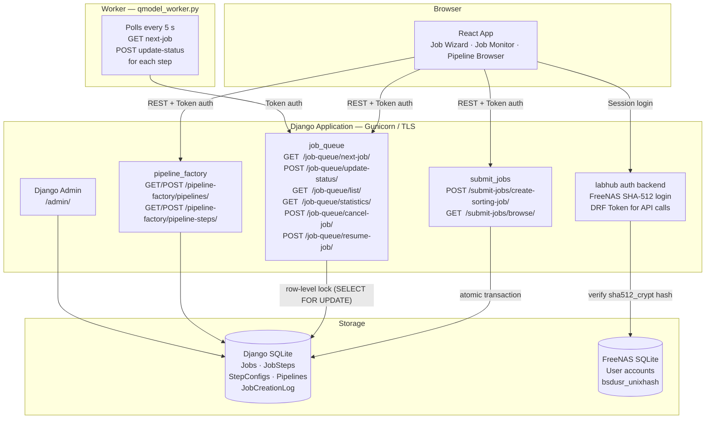

# Spike Sorting Lab Hub

A spike sorting job management system built for neuroscience researchers. Submit spike sorting pipelines via a web wizard, track every step in real time, and let a background worker execute them — all through a single self-hosted Django + React application.

---

## Demo

https://github.com/user-attachments/assets/a04b2a0e-7ba0-4eca-8ef3-294b84a52cc3

---

## Architecture



---

## How It Works

### Job Submission

1. Researcher fills the React wizard — selects a recording file, a pipeline, and an environment preset.
2. `POST /submit-jobs/create-sorting-job/` validates the request, hashes the recording config with SHA-256, and deduplicates it in `StepConfig`.
3. Pipeline steps are loaded from `pipeline_factory`, their `_RECORDING_` placeholders resolved to the real recording hash, and all steps written atomically as a `Job` + `JobStep` records with `status=pending`.

### Queue & Worker

4. `qmodel_worker.py` polls `GET /job-queue/next-job/` every 5 seconds.
5. The endpoint uses `SELECT FOR UPDATE` to grab the oldest pending job atomically and marks it `fetched`, preventing duplicate picks by concurrent workers.
6. The worker receives the full job payload (steps, configs, environment) and processes each step in dependency order.
7. After each step the worker calls `POST /job-queue/update-status/` — step statuses move `pending → running → completed`. When all steps finish, the job is marked `completed`.

### Authentication

- **Browser login:** checked against the FreeNAS SQLite database (`account_bsdusers.bsdusr_unixhash`) using `passlib` SHA-512 crypt. Django user records are created on first successful login with an unusable password.
- **API calls:** every request requires `Authorization: Token <token>` (Django REST Framework token auth).

---

## Tech Stack

| Layer | Technology |
|-------|------------|
| Backend | Django 5.2 + Django REST Framework |
| Frontend | React 18 (built with `npm run build`, served by WhiteNoise) |
| Database | SQLite — path configurable via `DATABASE_PATH` |
| Auth | FreeNAS SHA-512 for web login · DRF Token for API |
| Worker | `qmodel_worker.py` — Python polling consumer |
| Server | Gunicorn with TLS 1.2+ (ports 9000 HTTP / 9443 HTTPS) |
| Deployment | Docker (Ubuntu 24.04 base image) |

---

## Key Features

- End-to-end job creation with atomic transactions
- SHA-256 config deduplication — identical step configs are stored once and reused across jobs
- Pipeline dependency resolution — steps declare dependencies via config hash references
- FIFO queue with row-level database locking — safe for concurrent workers
- Real-time status tracking via React UI
- Django Admin for manual job and step control
- WhiteNoise static file serving — no Nginx needed
- Self-signed TLS built into Gunicorn (no reverse proxy required)

---

## Project Structure

```
labhub/              Django project — settings, root URLs, FreeNAS auth backend
job_queue/           Job and step models, worker-facing endpoints (next-job, update-status)
pipeline_factory/    Pipeline and PipelineStep models, pipeline management API
submit_jobs/         Job creation API — serializers, recording config, dependency resolver
my-app/              React frontend source; build/ is served by Django via WhiteNoise
qmodel_worker.py     Standalone Python worker — polls the API and processes jobs
gunicorn.conf.py     Gunicorn config — binds 0.0.0.0:9000, TLS hardening, worker count
docker-compose.yml   Production container with bind mounts for NAS, DB, and certs
Dockerfile           Ubuntu 24.04, Python 3.13, npm build, collectstatic
NAS_Database/        FreeNAS SQLite DB (freenas-v1.db) — user account source of truth
```

---

## Deployment — Docker (Production)

### Prerequisites

- Docker + Docker Compose on the server
- NAS mounted at `/mnt/root_data_storage/`
- `DJANGO_SECRET_KEY` set in the environment

### Port layout

The NAS itself occupies ports 8000, 8080, and 8443. This app uses:

| Protocol | Host port | Container port |
|----------|-----------|----------------|
| HTTPS | 9443 | 9443 |

### Bind-mount layout

| Host path | Container path | Access |
|-----------|---------------|--------|
| `/mnt/root_data_storage/users/sslh/trurnasdata` | `/data` | read-only (FreeNAS DB) |
| `/mnt/root_data_storage/users/sslh/persistentdata` | `/django_db` | read/write (Django DB + logs) |
| `/mnt/root_data_storage/experiments` | `/experiments` | read-only (binary recordings) |
| `./secrets` | `/app/secrets` | read/write (SSL certs) |

### Build and run

```bash
export DJANGO_SECRET_KEY="your-secret-key-here"
docker compose build
docker compose up -d
docker compose logs -f
```

SSL certificates are generated automatically by `entrypoint.sh` on first start into `./secrets/`.

### First-time setup inside the container

```bash
docker compose exec spikesorting-labhub python manage.py migrate
docker compose exec spikesorting-labhub python manage.py createsuperuser
```

### Access

| URL | Purpose |
|-----|---------|
| `https://<server-ip>:9443/` | React web UI |
| `https://<server-ip>:9443/admin/` | Django Admin |

---

## Local Development (without Docker)

### Prerequisites

- Python 3.13+
- Node.js 18+

### Setup

```bash
# Backend
python3 -m venv venv
source venv/bin/activate
pip install -r requirements.txt
python manage.py migrate

# Frontend — build React into Django's static root
cd my-app && npm install && npm run build && cd ..
python manage.py collectstatic --noinput

# Start server (HTTP)
gunicorn -c gunicorn.conf.py labhub.wsgi:application
# or for quick iteration
python manage.py runserver 0.0.0.0:9000
```

### Environment Variables

| Variable | Default | Description |
|----------|---------|-------------|
| `DJANGO_SECRET_KEY` | insecure dev key | Must be set in production |
| `DJANGO_DEBUG` | `True` | Set `False` in production |
| `DATABASE_PATH` | `Django_database/db.sqlite3` | Path to Django SQLite file |
| `NAS_DB_PATH` | `NAS_Database/freenas-v1.db` | Path to FreeNAS user DB |
| `NAS_ROOT` | `experiments/` | Replaces `$NAS$` placeholders in job configs |
| `DATA_DIRS` | `experiments/,experiments/probes/` | Dirs scanned for recording/probe files |

---

## Running the Worker

The worker runs separately from the server and must use a valid API token.

```bash
# Terminal 1 — server
source venv/bin/activate
gunicorn -c gunicorn.conf.py labhub.wsgi:application

# Terminal 2 — worker (HTTP)
source venv/bin/activate
python qmodel_worker.py

# Terminal 2 — worker (HTTPS with self-signed cert)
source venv/bin/activate
LABHUB_BASE_URL=https://localhost:9443 LABHUB_SSL_VERIFY=false python qmodel_worker.py
```

The token in `qmodel_worker.py` (`TOKEN = "..."`) must match a valid DRF token in the Django database. Generate or look up tokens via the Admin panel or:

```bash
python manage.py shell -c "
from rest_framework.authtoken.models import Token
from django.contrib.auth.models import User
token, _ = Token.objects.get_or_create(user=User.objects.get(username='Kajal'))
print(token.key)
"
```

---

## API Reference

All endpoints require token authentication:

```
Authorization: Token YOUR_TOKEN_HERE
```

**Get a token:**
```bash
curl -X POST http://localhost:9000/job-queue/api-token-auth/ \
  -H "Content-Type: application/json" \
  -d '{"username": "Kajal", "password": "yourpassword"}'
```

### Endpoints

| Method | Endpoint | Description |
|--------|----------|-------------|
| POST | `/submit-jobs/create-sorting-job/` | Create a new job |
| GET | `/submit-jobs/browse/` | Browse server-side recording and probe files |
| GET | `/job-queue/list/` | List jobs (filter by `status`, `limit`, `offset`) |
| GET | `/job-queue/<job_id>/` | Job detail with all step statuses |
| GET | `/job-queue/statistics/` | Count breakdown by status |
| GET | `/job-queue/all/` | All jobs unfiltered |
| POST | `/job-queue/cancel-job/` | Cancel a pending or running job |
| POST | `/job-queue/resume-job/` | Resume a canceled job |
| GET | `/job-queue/next-job/` | Worker: fetch and lock next pending job |
| POST | `/job-queue/update-status/` | Worker: update job or step status |
| GET/POST | `/pipeline-factory/pipelines/` | List or create pipelines |
| GET/POST | `/pipeline-factory/pipeline-steps/` | List or create pipeline steps |

### Create Job — example

```bash
curl -X POST http://localhost:9000/submit-jobs/create-sorting-job/ \
  -H "Authorization: Token YOUR_TOKEN" \
  -H "Content-Type: application/json" \
  -d '{
    "recording": {
      "binfile": "/data/recording.bin",
      "sampling_rate": 30000,
      "num_channels": 32,
      "gain_to_uV": 0.195,
      "offset_to_uV": 0,
      "probe": "/data/probe.json"
    },
    "pipeline_id": 1,
    "environment": "local"
  }'
```

---

## Status Flow

```
Job:   pending → fetched → running → completed
                                   → failed
                                   → canceled

Step:  pending → running → completed
                         → failed
```

Jobs move from `pending` to `fetched` the moment a worker claims them. Steps transition independently as the worker processes each one.

---

## Running Tests

```bash
python manage.py test -v 2
```

---

## Troubleshooting

| Issue | Fix |
|-------|-----|
| Worker gets 401 | Token in `qmodel_worker.py` doesn't match the DB — update it or generate a new token |
| Worker gets "Connection refused" | The Django server is not running — start it first |
| Job stuck in `fetched` | Worker crashed mid-job — use Admin or API to reset to `pending` |
| Login fails from browser | Password must be updated in the FreeNAS SQLite DB (`bsdusr_unixhash`), not via Django shell |
| Port conflict | NAS uses 8000, 8080, 8443 — this app uses 9000 / 9443 |
| `collectstatic` fails | Run `npm run build` inside `my-app/` first to generate `build/` |
| Container can't write DB | Check `/mnt/root_data_storage/users/sslh/persistentdata` exists and is writable |
